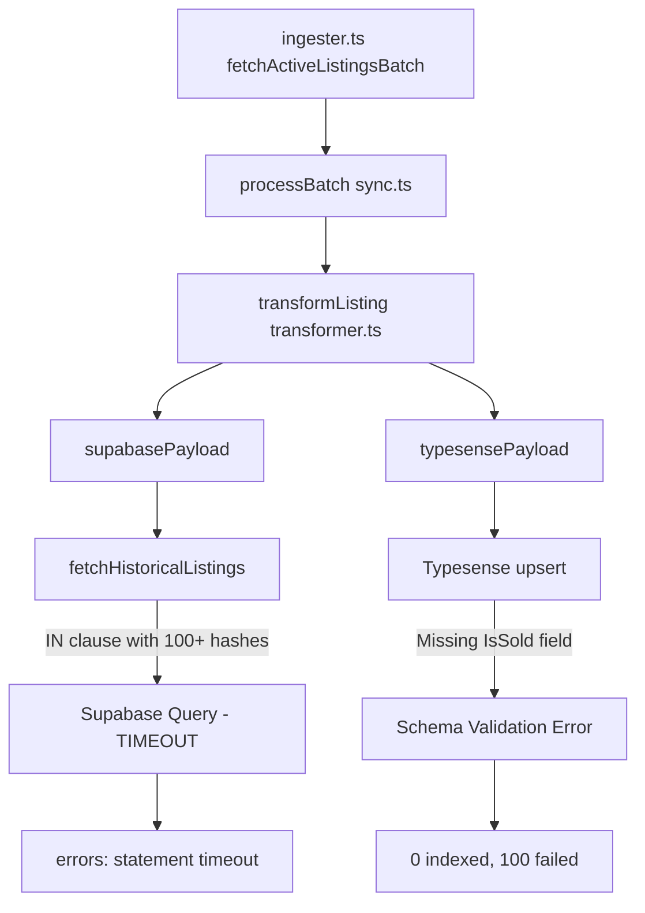
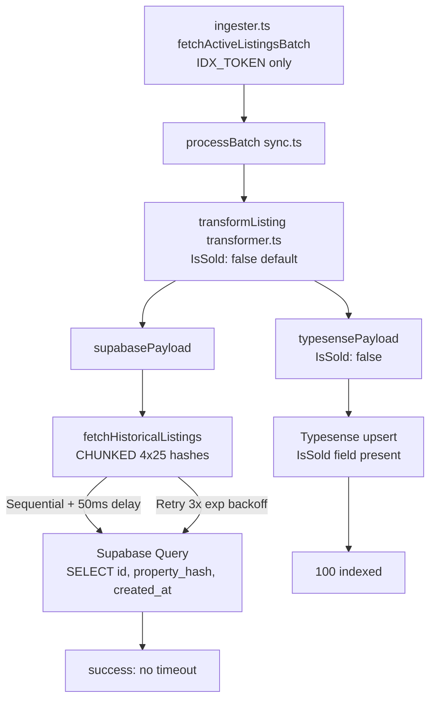

# Project Memory

This file tracks architectural decisions, database changes, and rule updates.

## Capacity Triage: Typesense memory + Supabase Disk IO (2026-05-19)

### Trigger
Same-day alerts:
- Supabase project `pyzgnivilxhnwzfrdkiq` depleting Disk IO Budget
- Typesense cluster `9uyapwh6e5qmvl34p` Low Free Memory (41MB free, p95)

### Typesense root cause
~22 numeric fields declared `facet: true` in `typesenseSchema.ts` were never
consumed as facets — every UI filter in `queryBuilder.ts` and
`commandCenterStore.ts` uses range syntax (`>=`, `<=`, `[min..max]`).
`PostalCode` faceted at tens of thousands of unique values. Faceted fields
materialize per-document value maps in RAM, so unused facets are pure RAM
waste.

**Fix applied to live cluster:** `scripts/admin/optimizeTypesenseFacets.ts --apply`
PATCHed 22 fields on the live `properties` collection (29,246 docs):
ListPrice, BedroomsTotal, BathroomsTotalInteger, ParkingTotal, PostalCode,
KitchensTotal, LotWidth, LotDepth, LotSqftTotal, TotalCapitalBasis,
ExtrapolatedCapRate, CapitalBurnRateMonthly, MonthlyCarryCost, TrueDom,
SuiteScore, cap_rate_est, cap_rate_floor, gross_yield_est,
net_monthly_cashflow, cashflow_floor, tax_burden_ratio, surplus_parking_count.

**Manual still required:** enable "Capacity Auto-Upgrade" in the Typesense
Cloud console (Cluster Configuration → Modify). Not script-accessible.

### Supabase root cause
Original hypothesis (missing `idx_listings_property_hash`) was WRONG — that
index exists and has 477k scans. Real cause: massive **index-write
amplification** on the upsert-heavy `listings` table. Audit of
`pg_stat_user_indexes` showed every non-unique listings index plus
`idx_vow_sold_hash` had ZERO scans yet were being maintained on every
write. Worst offender: `idx_listings_full_payload_gin` — 175 MB, GIN on
JSONB, 0 reads, rewritten on every UPSERT (GIN-on-JSONB is the most
expensive index type to maintain).

**Fix:** `supabase/migrations/010_drop_unused_indexes.sql` — drops
`idx_listings_full_payload_gin`, `idx_vow_sold_hash`, and 9 small never-read
listings indexes via `DROP INDEX CONCURRENTLY IF EXISTS`. Migration must be
run via Supabase SQL Editor (the pooler credentials in
`scripts/admin/forceIndexes.ts` are stale — pooler returned "tenant/user not
found").

**Indexes to KEEP forever:**
- `idx_listings_property_hash` (hot path, ~477k scans)
- `idx_vow_sold_region_date` (AVM anchor, ~11 scans)
- All `*_pkey` and `*_key_key` (unique/PK)

### Code cleanup
- `scripts/worker/transformer.ts:calculateTrueDOM` is dead code — sync.ts
  uses the pure-function version from
  `src/lib/typesense/TemporalDistressEngine.ts`. The transformer version
  issued per-listing queries selecting `full_payload`, which is exactly
  the IO pattern that caused the alert. Marked `@deprecated DO NOT CALL`
  in a strongly-worded JSDoc so it can't get accidentally re-wired.
- `pg_stat_statements` showed 11,816 historical calls of that old query
  shape (6.4M ms cumulative) — those are pre-fix stats; current code path
  is the 1,769-call variant at 58s total.

### Files created/modified
- `src/lib/typesense/typesenseSchema.ts` — facet policy comment + 22 demotions
- `scripts/admin/optimizeTypesenseFacets.ts` — idempotent PATCH script with --apply gate
- `scripts/admin/verifyAndApplyIndexes.ts` — pg pooler audit (currently blocked by stale creds)
- `supabase/migrations/010_drop_unused_indexes.sql` — the IO-relief drops
- `scripts/worker/transformer.ts` — deprecation JSDoc on dead `calculateTrueDOM`

### Operational rule (for future schema work)
Never set `facet: true` on a Typesense numeric field unless the UI actually
renders facet buckets/counts for it. Range sliders (`>=`, `<=`) only need
`sort: true`. Same logic in reverse for Postgres: don't add indexes for
"completeness" — every index on `listings` is paid for on every UPSERT in
the sync pipeline, and unused indexes are pure write tax.

## Setup (2025-05-04)

- Created `.clinerules` with task memory protocol and implementation guidelines
- Configured strict directive to read MEMORY.md before tasks and append summaries after
- Established 4-step implementation protocol: Draft → Test → Execute → Review
- Set up `/docs` folder for future SOP storage

## Bug Fix: Typesense Filter Syntax (2026-05-04)

### Problem
When filtering properties, the Typesense search threw HTTP 400 "Could not parse the filter query" errors. This caused the properties page to show no data when room count, price, or other filters were applied.

### Root Cause
Typesense requires a specific colon-operator syntax for filter queries. The code was using JavaScript-style operators with spaces:
- **Wrong:** `ListPrice >= 500000` (throws HTTP 400)
- **Correct:** `ListPrice:>=500000` (works)

### Solution
Updated `src/lib/typesense/client.ts` to use strict Typesense filter syntax:
- Comparison operators MUST be preceded by a colon: `FieldName:>=Value`
- String equality uses colon: `City:=Toronto`
- Multiple filters joined with exactly ` && ` (with spaces)

### Test Results (After Fix)
- `type=buy&minPrice=1000000` → 18,875 results ✓
- `type=buy&minPrice=1000000&BedroomsAboveGrade=4` → 12,741 results ✓ (all listings have 4+ bedrooms)
- Combined filters now work correctly

### Files Modified
- `src/lib/typesense/client.ts` - Fixed all filter generation to use `FieldName:>=Value` syntax

## Phase 5: Shadow MLS ETL Derived Metrics Engine (2026-05-10)

### Overview
Implemented three new derived metrics engines in the ETL transformer for the Smart Homebuyer persona.

### 1. True Carry Cost Engine
Canadian mortgage calculation with semi-annual compounding for investment properties.

**Macros (May 2026):**
- Down Payment: 20%
- Investor Rate: 4.04% (5-year fixed)
- Amortization: 360 months

**Components:**
- Monthly Mortgage: Canadian semi-annual compounding formula
- Monthly Property Tax: Actual TaxAnnualAmount / 12 OR municipal mill rate
- Monthly HOA: AssociationFee for condos, $0 for freehold
- Monthly Insurance: $40 condo, $135 freehold, $200 multi-family
- Monthly Utilities: $0 for tenant-pays, $350 for multi-family inclusive
- Monthly CapEx: 1% list price/year (freehold), 0.5% (condo), -20% if age < 5 years

**Municipal Mill Rates:**
- Toronto: 0.007, Brampton: 0.010, Mississauga: 0.009, etc.

### 2. True Days on Market (TrueDOM) Engine
Entity resolution using SHA-256 property hash for linking historical listing chains.

**Address Normalization:**
- Strip punctuation, lowercase, standardize suffixes
- Concat: StreetNumber | StreetName | UnitNumber | PostalCode | City

**Campaign Block Logic:**
- Gap ≤ 45 days → same campaign (cumulative DOM)
- Gap > 90 days → new campaign (reset DOM to 0)
- Dead days = max(0, trueDOM - 30)
- Stale if trueDOM > 90

### 3. Secondary Suite Status Engine
Scoring system for ADU/income suite potential.

**Kill Switch:**
- Condo, CondoCorpNumber exists, Condo Townhouse → NONE

**Auto-Pass (EXISTING_SUITE):**
- KitchensBelowGrade > 0
- PropertySubType is "Multiplex" or "Duplex"
- PublicRemarks matches: /(currently rented|tenant|existing.*suite)/i

**Scoring (need 3+ for POTENTIAL_CANDIDATE):**
- +1: Basement has "Full" (not "Crawl Space")
- +2: PublicRemarks matches /(separate.*entrance|walk-out|walkup)/i
- +1: Basement bathroom OR rough-in present
- +1: RoomsBelowGrade >= 2
- +1: ParkingTotal >= 2
- -2: ParkingTotal < 2 (fatal flaw)

### Files Created/Modified
- `scripts/worker/transformer.ts` - Added all three engines
- `supabase/migrations/005_add_carry_cost_suite_columns.sql` - New migration
- `src/lib/typesense/typesenseSchema.ts` - Added new fields

### New Typesense Fields
- MonthlyCarryCost (facet: true, sort: true)
- MonthlyMortgage, MonthlyPropertyTax, MonthlyHOA, MonthlyInsurance, MonthlyCapEx
- SuiteStatus (facet: true), SuiteScore (facet: true, sort: true)
- IsStale (bool, facet: true)

## New Feature: Smart Homebuyer Command Center (2026-05-05)

### Overview
Implemented a 100vh "Command Center" interface for the Smart Homebuyer persona with:
- Top Command Bar (persona selector + filters)
- Right Panel Ledger (high-density property list)
- 70/30 Split Terminal (property detail modal)

### Files Created

**Store:**
- `src/lib/stores/commandCenterStore.ts` - Zustand store for Command Center state management
  - Persona selection (Cashflow Investor, Builders & Developers, Flippers & Deal Hunters, Smart Homebuyer)
  - Smart Homebuyer filters (Max Carry Cost, True DOM, Mortgage Helper, CapEx Risk, Bidding War Excluder)
  - Terminal state management (selected property, open/close)

**Command Center Components:**
- `src/components/CommandCenter/TopCommandBar.tsx` - Persona selector + Smart Homebuyer filters
- `src/components/CommandCenter/LedgerPanel.tsx` - Right panel high-density data grid
- `src/components/CommandCenter/LedgerRow.tsx` - Individual property row with Alpha badges
- `src/components/CommandCenter/AlphaBadge.tsx` - Military-style HUD badges for property flags
- `src/components/CommandCenter/ListingTerminal.tsx` - 70/30 split terminal for property details
- `src/components/CommandCenter/CarryCostCalculator.tsx` - Interactive mortgage calculator
- `src/components/CommandCenter/DOMTimelineChart.tsx` - Recharts-based price timeline visualization
- `src/components/CommandCenter/index.ts` - Barrel export

**UI Components:**
- `src/components/ui/label.tsx` - Label component (missing from shadcn/ui)

**Styles:**
- `src/app/globals.css` - Added terminal aesthetic styles (custom scrollbar, slider styling, badge styles)

### Command Center Features

**Persona Selector:**
- Dropdown with 4 personas: Cashflow Investor, Builders & Developers, Flippers & Deal Hunters, Smart Homebuyer

**Smart Homebuyer Filters:**
- Max True Carry Cost: Slider ($500-$10,000/mo)
- Negotiation Leverage (True DOM): Slider (0-120+ days)
- Mortgage Helper: Toggle (KitchensBelowGrade > 0 OR basement suite potential)
- CapEx Risk: Dropdown (Move-In Ready / Light TLC / Major Work)
- Bidding War Excluder: Toggle (excludes holding offers, presentation dates)

**Alpha Badge System:**
- INCOME SUITE (emerald-400)
- SUITE POTENTIAL (blue-400)
- DISTRESSED (rose-400)
- HOLDING OFFERS (amber-400)
- PRICE DROP [-X%] (emerald-400)
- TOP SCHOOL ZONE (purple-400)
- NEW LISTING (cyan-400)
- MOTIVATED SELLER (orange-400)

**70/30 Split Terminal:**
- Left Panel (70%): Asset details (scrollable)
  - Media Bento Grid
  - Structural Vitals Table
  - Room Ledger
  - Unvarnished Remarks (with NLP flag highlighting)
- Right Panel (30%): Calculator & Ledger (sticky)
  - Carry Cost Calculator (interactive mortgage calculation)
  - Suite Offset Estimator (conditional on Mortgage Helper)
  - DOM Timeline Chart (Recharts LineChart)

### Type Definitions Extended
Added to `src/lib/typesense/client.ts` ListingDocument:
- DaysOnMarket, primaryImageUrl, OriginalListPrice, KitchensBelowGrade, SchoolZone, PublicRemarks
- Heating, Cooling (building systems)

### Layout
- Full viewport height (100vh)
- 70/30 split layout (map area / ledger panel)
- Custom scrollbars (hidden but functional)
- Terminal aesthetic (slate-950 background, emerald/cyan accents)

### Dependencies Added
- `npm install zustand` - For state management

### Files Modified
- `src/app/properties/page.tsx` - Complete rewrite for Command Center layout

## Transformer Schema Compliance Fix (2026-05-10)

### Problem
Typesense sync was failing with "Field `X` has been declared in the schema, but is not found in the document" errors for multiple fields:
- `KitchensTotal`
- `Status`
- `LotSqftTotal`
- `AssociationFee` (and likely others)

### Root Cause
The transformer used conditional field assignment (only output if value exists), but Typesense requires ALL declared schema fields to be present in every document. This caused schema drift where new fields added to the schema weren't being output by the transformer.

### Solution
Changed transformer from conditional to unconditional field assignment with sensible defaults:
- String fields: `|| ''` fallback
- Numeric fields: `?? 0` fallback
- Calculated fields: always output (e.g., `LotSqftTotal` always has a value)

### Fields Fixed
1. **KitchensTotal** - Added to interface and transformer output with `?? 0` fallback
2. **Status** - Combined `Status`, `MlsStatus`, `StandardStatus` into single Status field with fallback chain
3. **LotSqftTotal** - Added as calculated field from `LotWidth * LotDepth` with fallback to 0
4. **AssociationFee** - Now outputs with fallback, not conditional
5. All string fields now use fallback instead of conditional assignment

### Files Modified
- `scripts/worker/transformer.ts` - Changed optional field section to use unconditional assignment with defaults
- `scripts/worker/sync.ts` - Added `Status`, `MlsStatus`, `AssociationFee` fields to mock test data

### Remaining Issue
Supabase `carry_cost` column missing - migration needs to be applied via `npx supabase db push`

## Phase 4: UI Layer — Zustand Filter Store & Terminal Components (2026-05-11)

### Overview
Built the Persona 2 (Cashflow Investor) UI layer with Zustand state management for all financial filters, Top Bar filter components, table column renderers, Alpha badges, and Financial Pro Forma sticky panel.

### Files Created

**Store:**
- `src/store/useFilterStore.ts` - Zustand filter store for Persona 2
  - Financial filters: capRateFloor, cashflowFloor, targetYieldMin
  - Multi-Unit filters: suiteFilters (PRIME_CANDIDATE, EXISTING_MULTI_UNIT, MARGINAL_CANDIDATE, NOT_VIABLE)
  - Property type filter: propertyTypeFilter (All, Freehold, Condo)
  - Occupancy filter: occupancyFilter (Vacant, Tenanted)
  - Parking filter: minParkingFilter (surplus parking count)
  - Tax burden filter: taxBurdenMax
  - Sort control: sortBy

**Typesense Query Builder:**
- `src/lib/typesense/queryBuilder.ts` - Builds filter query strings from filter store state
  - buildFilterQuery(): Generates Typesense filter string from active filters
  - buildSortQuery(): Returns sort string for current sortBy field

**Terminal Filter Components:**
- `src/components/terminal/Filters/TerminalFilters.tsx` - Top Bar filter UI
  - Cap Rate slider (0-12%, step 0.25%)
  - Cashflow floor slider (0-$5000/mo, step $50)
  - Yield min slider (0-12%, step 0.25%)
  - Suite status multi-toggle buttons (Prime/Existing/Marginal/None)
  - Occupancy toggle buttons (Vacant/Tenanted)
  - Min parking slider (0-6 surplus spaces)
  - Property type dropdown
  - Sort dropdown (Cap Rate/Cashflow/Yield/TrueDOM)

**Multi-Unit Badge Component:**
- `src/components/terminal/Badges/MultiUnitBadge.tsx` - Alpha badge system
  - AlphaBadge: Renders single badge with color-coded styling
  - PropertyBadges: Composite badge set for property cards
  - Badge statuses: PRIME_CANDIDATE, EXISTING_MULTI_UNIT, MARGINAL_CANDIDATE, INHERITED_TENANT_RISK, OVER_ASSESSED, UNDER_ASSESSED_RISK, PRICE_DISCOVERY
  - Surplus parking count badge

**Table Column Renderers:**
- `src/components/terminal/Table/Columns/CashflowColumns.tsx` - Financial metric cells
  - MetricCell: Base cell with conditional highlighting
  - CapRateCell: Shows estimated cap rate with floor annotation
  - CashflowCell: Shows net monthly cashflow with floor annotation
  - YieldCell: Shows gross yield estimate with TARGET indicator
  - OccupancyBadge: Renders TENANTED/VACANT status badges

**Financial Pro Forma Panel:**
- `src/components/terminal/ProForma/FinancialProForma.tsx` - Sticky panel for Property Detail page
  - Primary cashflow display (green/red based on positive/negative)
  - Cap rate comparison (estimated vs floor)
  - Suite potential section (for PRIME_CANDIDATE properties)
  - Assessment X-Ray (OVER_ASSESSED/UNDER_ASSESSED warning)
  - Route to Advisor CTA button

### Design System
- Background: bg-slate-950 for primary panels, bg-slate-900 for Top Bar
- Font: JetBrains Mono for all metrics and numbers
- Accent colors: emerald-400 (positive), amber-400 (warning), red-400 (negative)
- Terminal aesthetic: slate borders, rounded corners, subtle glows

## Phase 6: AVM — Anchor and Adjust Automated Valuation Model (2026-05-15)

### Architecture Overview
**Anchor and Adjust** architecture with complete separation between offline computation and live web execution:
- Pre-trained model extracts per-unit coefficients per feature (offline, in Colab)
- Coefficients uploaded to Supabase via CSV ingestion script
- Live calculation: 90-day average close_price from `raw_vow_sold` (anchor) + coefficient × input (adjustment)
- **Two-Tier Rule:** R² ≥ 0.50 → Apply coefficients; R² < 0.50 → Return anchor only

### Database Tables Created (Migration 006)
- `avm_audit_report`: Stores model R² and MAE per market/property-type combo
  - Columns: `city_region`, `property_sub_type`, `total_sales_analyzed`, `model_accuracy_score`, `average_error_margin`
  - Unique constraint on `(city_region, property_sub_type)`
- `avm_multiplier_matrix`: Stores per-unit coefficient multipliers
  - Columns: `city_region`, `property_sub_type`, `feature_name`, `dollar_per_unit`, `multiplier`
  - Unique constraint on `(city_region, property_sub_type, feature_name)`

### Backend Modules (`src/lib/avm/`)
| File | Purpose |
|------|---------|
| `types.ts` | `AVMInput`, `AVMResult`, `AVMAdjustmentBreakdown` interfaces + engine constants |
| `anchorService.ts` | Fetches 90-day avg `close_price` from `raw_vow_sold` (on-the-fly) |
| `auditService.ts` | Fetches R² score for gating decision |
| `matrixService.ts` | Fetches per-unit coefficients from multiplier matrix |
| `calculator.ts` | Core Two-Tier Rule: `calculateAVM()` with coefficient math |
| `validation.ts` | Zod schema for input validation |
| `index.ts` | Barrel export |

### API Route
- `POST /api/avm` — Accepts `AVMInput`, returns `AVMResult`
- Uses `getServerClient()` from `@/lib/supabase/client`
- Zod validation with 400 error on invalid input

### Score Conversion (Python extraction logic)
| Tier Input | Model Score |
|-----------|------------|
| `interiorTier` (1-5) | `6 - interiorTier` (range 5→1) |
| `exteriorTier` (1-5) | `5 - exteriorTier` (range 4→0) |
| `basementTier` (1-9) | `10 - basementTier` (range 9→1) |

### Frontend Components (`src/components/avm/`)
- `AVMCalculator.tsx` — Main container, handles API call and state
- `AVMPropertyForm.tsx` — Left panel: property profile form with tier selectors
- `AVMResultDisplay.tsx` — Right panel: price display, engine badge, breakdown

### Store
- `src/store/useAVMStore.ts` — Zustand store for form state and results

### CSV Ingestion Script
- `scripts/worker/avm/ingest-matrices.ts` — Standalone Node script for loading CSV exports
- Uses custom `parseCsv()` (no external dependency)
- `ON CONFLICT DO UPDATE` upsert to handle re-runs
- Column mapping: `Average_Dollar_Impact (Historical)` → `dollar_per_unit`, `Percentage_Multiplier (Future-Proof)` → `multiplier`

### Key Decisions Enforced
- Decision #5: All field names in code use camelCase (schema uses snake_case per CSV)
- Decision #6: All standalone scripts start with `import 'dotenv/config'`
- Decision #12: All Supabase service calls wrapped in try/catch with fallback defaults
- Decision #13: Each service is isolated, single responsibility
- **BAN:** Word "AI" does not appear anywhere in AVM code — uses `COEFFICIENT_ADJUSTED` / `ENGINE_MODE` terminology

### Pages
- `src/app/avm/page.tsx` — Standalone AVM terminal page at `/avm`

### Pre-existing TypeScript Errors (unrelated to AVM)
These errors existed before AVM implementation:
- `src/app/properties/page.tsx(106,107)`: `minTrueDOM` missing from `SmartHomebuyerFilters`
- `src/components/CommandCenter/LedgerRow.tsx(39)`: `DaysOnMarket` missing from `ListingDocument`
- `src/components/CommandCenter/ListingTerminal.tsx(81)`: Same `DaysOnMarket` issue
- `src/lib/typesense/transformListing.ts(338)`: `listing_key` not in `TypesensePropertyDocument`

## Daily Sync Automation — Ingester Route to raw_vow_sold (2026-05-16)

### Overview
Implemented Decision A1 from the architecture plan: the ingester now feeds the AVM's `raw_vow_sold` anchor table by routing all "Sold" or "Closed" listings to an append-only table in Supabase.

### Changes Made

**1. scripts/worker/ingester.ts — Sold Listing Routing**
Added three new functions and routing logic within the delta sync loop:
- `isSoldListing(status)` — Checks if listing status is 'Closed' or 'Sold' (case-insensitive)
- `extractSoldListingData(raw)` — Maps relevant fields (ListingKey, ClosePrice, CloseDate, CityRegion, PropertySubType, etc.) to the `raw_vow_sold` schema
- `upsertSoldListings(supabase, soldRecords)` — Performs `ON CONFLICT (listing_key) DO UPDATE` upsert to avoid duplicates

**Routing Logic (within runDeltaSync loop):**
- Before processing the batch through sync.ts, the ingester now extracts sold listings
- Calls `upsertSoldListings()` for each sold record
- This ensures the AVM's anchor table stays current for the 90-day rolling average

**2. .github/workflows/daily-sync.yml — GitHub Actions Automation**
Created GitHub Actions workflow that runs daily at 3:00 AM (UTC):
- Triggers `npx tsx scripts/worker/ingester.ts sync`
- Passes environment secrets: NEXT_PUBLIC_SUPABASE_URL, SUPABASE_SERVICE_ROLE_KEY, RESO_BEARER_TOKEN
- Also allows manual workflow_dispatch trigger from GitHub website

### Decision A1 Enforcement
The ingester now follows the "append-only for daily sync, read-only for anchor queries" rule:
- Sold/Closed listings are UPSERTED (not inserted only) to handle re-runs
- `raw_vow_sold` is treated as sacred — no migrations altering its schema
- The 217,000 historical records in production are untouched

### GitHub Secrets Required
For the workflow to function, these secrets must be added to the GitHub repository:
- `NEXT_PUBLIC_SUPABASE_URL`
- `SUPABASE_SERVICE_ROLE_KEY`
- `RESO_BEARER_TOKEN`

## Daily Sync for AVM Raw Vow Sold (2026-05-16)

### Overview
Implemented Daily Sync to route Sold/Closed listings from MLS feed to `raw_vow_sold` table for AVM anchor calculations. Decision A1: raw_vow_sold is append-only for daily sync, read-only for AVM queries.

### Files Modified
- `scripts/worker/ingester.ts` - Added sold listing routing with `isSoldListing()` and `extractSoldListingData()` functions
- `scripts/worker/transformer.ts` - Added OccupantType and PossessionType fields for Typesense schema compliance (lines 1034-1038)
- `.github/workflows/daily-sync.yml` - Created GitHub Actions workflow running at 3:00 AM UTC daily

### OData Query Fix
Fixed double-encoding issue where filter parts were encoded individually then combined and encoded again, causing `%2520` instead of `%20`.
- Query: `(StandardStatus eq 'Active' or StandardStatus eq 'Closed' or MlsStatus eq 'Sold') and (ModificationTimestamp gt datetime'...')`

### 48-Hour Catch-Up Window
Bypassed `readSyncState()` which was returning "now" timestamp. Hardcoded 48h catch-up timestamp with Z formatting:
- `2026-05-14T00:46:12.859Z` (48 hours before sync start)

### Pending Issues (Pre-existing bugs)

**1. Supabase property_hash integer error**
- Error: `invalid input syntax for type integer: "{"propertyHash":"...","trueDOM":0,...}"`
- Location: `scripts/worker/sync.ts` lines 219-222
- Cause: The `supabasePayload` object contains nested `true_dom` object with temporal metrics, but `property_hash` column is integer. When spreading `t.supabasePayload`, the entire `true_dom` object (JSON string) gets passed to integer column.
- The temporalMetrics map correctly extracts `property_hash` string, but the spread `...t.supabasePayload` brings in the nested object.

**2. Typesense PossessionType missing from transformer**
- Error: `Field 'PossessionType' has been declared in the schema, but is not found in the document.`
- Status: FIXED - Added `typesensePayload.PossessionType = raw.PossessionType || '';` at line 1038
- Also added `typesensePayload.OccupantType = raw.OccupantType || '';` at line 1035
- Note: Running script uses cached code; fix takes effect on restart

**3. Board data status fields empty**
- All listings show `StandardStatus=''`, `MlsStatus=''`, `ClosePrice=0`, `CloseDate=null`
- Board may use different field names for status or data is not populated
- `isSoldListing()` correctly identifies all listings as ACTIVE due to empty fields
- No sold/closed listings found in 10,960 records

### Test Results (2026-05-16)
- Sync completed: 10,960 records, 110 pages
- Errors: 220 (all pre-existing bugs)
- Sold listings found: 0 (board data issue)

## Dual-Query Sync Architecture (2026-05-16)

### Problem
The 48-hour delta sync pulled 0 sales because this specific board does NOT reliably update `ModificationTimestamp` when a listing closes — they only update `CloseDate`. The board IS using standard RESO fields (`StandardStatus="Closed"`, `ClosePrice`, `CloseDate`).

### Solution: Dual-Query Architecture
Implemented two distinct API queries to guarantee capture of all listings:

**Query A (Active Sync):**
- Filter: `StandardStatus eq 'Active' and ModificationTimestamp gt [lastSyncTimestamp]`
- Routes to: Typesense listings table (via `processBatch()`)
- Query function: `fetchActiveListingsBatch()`

**Query B (Sold Sync):**
- Filter: `(StandardStatus eq 'Closed' or MlsStatus eq 'Sold') and CloseDate ge [lastSyncDate]`
- Routes to:
  1. `raw_vow_sold` (AVM anchor table) via `upsertSoldListings()`
  2. Typesense with `IsSold: true` via `processBatch(rawListings, { isSold: true })`
  3. Supabase listings table (full document for historical charting)
- Query function: `fetchSoldListingsBatch()`
- Note: `CloseDate` is a Date string (e.g., `2026-05-14`), not ISO timestamp — filter formatted as `CloseDate ge 'YYYY-MM-DD'`

### Execution Flow
Sequential in `runDeltaSync()`:
1. Query A first → paginate active listings via `ModificationTimestamp`
2. Query B immediately after → paginate sold listings via `CloseDate` (date string)
3. Update `sync_state.last_sync_timestamp` when both complete

### isSoldListing() Reverted
Simplified to standard RESO checks only:
```typescript
function isSoldListing(raw: any): boolean {
  const standardStatus = raw.StandardStatus || '';
  const mlStatus = raw.MlsStatus || '';
  return standardStatus.toLowerCase().trim() === 'closed' || mlStatus.toLowerCase().trim() === 'sold';
}
```

### Bug Fix: property_hash Integer Crash
**Root Cause:** `supabaseRecords` used spread `{...t.supabasePayload}` which included the nested `true_dom` object. Later reassigning `property_hash` caused the entire `true_dom` JSON string to be passed to the INTEGER column.

**Fix:** Build records explicitly in `sync.ts` Step 5 to avoid accidentally including nested objects:
```typescript
const supabaseRecords = transformed.map(t => {
  const metrics = temporalMetrics.get(t.supabasePayload.listing_key);
  const p = t.supabasePayload;
  return {
    listing_key: p.listing_key,
    full_payload: p.full_payload,
    // ... explicit fields only, no spread operator
    property_hash: metrics?.property_hash || '',
    // ...
  };
});
```

### Typesense Schema Update
Added `IsSold` field (bool, facet: true) to `indexedFields` in `typesenseSchema.ts` for frontend filtering of sold listings.

### Files Modified
- `scripts/worker/ingester.ts` - Dual-Query sync loop, new fetch functions
- `scripts/worker/sync.ts` - `processBatch()` optional `isSold` flag, explicit record building
- `src/lib/typesense/typesenseSchema.ts` - Added `IsSold` indexed field

### Known Issue: CloseDate Not Filterable
This board's RESO API does NOT allow `CloseDate` in $filter expressions:
- Error: `"Field not allowed in filter: CloseDate"`

All OData v4 date literal formats were attempted and rejected:
- `datetime'2026-05-16'` → "The types 'Edm.Date' and 'Edm.String' are not compatible"
- `datetime'...'` → "The property 'datetime' is not defined"
- `date'2026-05-16'` → "The property 'date' is not defined"
- Unquoted `CloseDate ge 2026-05-16` → "Field not allowed in filter: CloseDate"

**Current Solution:** Query B uses only the status filter `(StandardStatus eq 'Closed' or MlsStatus eq 'Sold')` with `$orderby=CloseDate desc` for server-side sorting. Client-side pruning stops pagination when CloseDates older than the 48-hour cutoff are encountered.

**48-Hour Catchup Mode:** During initial catchup, we run with a hardcoded 48-hour timestamp that gates results. Once synced, subsequent runs use `readSyncState()` which provides proper time-based gating. A future enhancement would require board support for proper date filtering.

## Investigation: Keen-Emotion Railway Sync Failure (2026-05-17)

### Error Summary
Two critical failures during ETL sync on page 44 (skip: 4300):

1. **Supabase:** `canceling statement due to statement timeout`
2. **Typesense:** `0 documents imported successfully, 100 documents failed during import`

### Root Cause Analysis

#### Problem 1: Supabase Statement Timeout
**Location:** `sync.ts` lines 93-101 (`fetchHistoricalListings()`)

The historical listing fetch uses:
```typescript
.in('property_hash', propertyHashes)
.not('listing_key', 'in', `(${excludeListingKeys.map(k => `'${k}'`).join(',')})`)
```

With 4,300 records already synced and high-density property_hash clusters, the `IN` clause with 100+ property hashes AND the nested `NOT IN` exclusion list causes the query to exceed Supabase's statement timeout limit.

**Fix Options:**
1. Add `timeout` configuration to the Supabase client (via connection string or RPC)
2. Reduce batch size for historical fetches (process 50 instead of 100)
3. Add index on `property_hash` column if missing
4. Use pagination with `limit/offset` instead of `IN` clause for large batches

#### Problem 2: Typesense Import Failure
**Location:** `sync.ts` lines 312-315, `typesenseSchema.ts` lines 71-72

The `IsSold` field:
- EXISTS in schema (`typesenseSchema.ts:72`) ✅
- IS OUTPUT by transformer ❌ (`transformer.ts` only outputs `IsStale`)

The transformer does NOT output `IsSold` in `typesensePayload`, but sync.ts adds it at line 275:
```typescript
if (options?.isSold) {
  doc.IsSold = true;
}
```

However, the base document structure comes from `t.typesensePayload` (line 266) which lacks `IsSold`. When Typesense receives a document missing a schema field during upsert, it may reject the entire batch with schema validation errors.

**Fix Options:**
1. Add `IsSold: false` as default to `typesensePayload` in transformer
2. Ensure `IsSold` field is initialized to `false` for all documents before sync.ts conditional flag
3. Check if Typesense error is specifically a schema validation error

### Mermaid Diagram: ETL Pipeline Flow


### Recommended Fix Sequence
1. **Immediate:** Add `IsSold: false` default to transformer typesensePayload
2. **Short-term:** Add query timeout hint to Supabase historical fetch
3. **Medium-term:** Reduce batch size to 50 for large skip values (>1000)
4. **Long-term:** Add database index on `property_hash` for faster lookups

## ETL Pipeline Fixes: Chunking, Feed Isolation, and Schema Compliance (2026-05-17)

### Overview
Implemented comprehensive fixes to eliminate Supabase timeouts and Typesense batch drops on page 44+ of the sync pipeline.

### Changes Made

#### 1. transformer.ts - IsSold Field + Defensive Defaults
**File:** `scripts/worker/transformer.ts`

- Added `IsSold?: boolean` to `typesensePayload` interface (line 756)
- Added `IsSold: false` default in typesensePayload initialization (line 993)
- This ensures Typesense always has the `IsSold` field, avoiding schema validation errors

#### 2. sync.ts - Chunked Historical Lookup + Retry Loops
**File:** `scripts/worker/sync.ts`

**Chunking (100 → 25 hashes):**
- Added `chunkArray<T>()` helper function for splitting arrays
- Added `sleep()` utility for rate limiting
- `fetchHistoricalListings()` now splits 100 hashes into 4 chunks of 25
- Each chunk processed sequentially with 50ms inter-chunk delay

**Query Optimization:**
- Historical query now selects only `id, property_hash, created_at` (not full_payload JSONB)
- Explicit column selection reduces network payload size

**Retry Loop (3 attempts, exponential backoff):**
- Historical fetch: retry with delay `Math.pow(2, attempt) * 500` (500, 1000, 2000ms)
- Supabase upsert: same retry pattern
- Prevents pipeline stalls on transient network/database gateway issues

**Error Verbosity:**
- Typesense import failure now dumps each failed document's error line-by-line
- Format: `📄 Document [ListingKey]: [error message]`

#### 3. ingester.ts - Feed Isolation (Separate Tokens)
**File:** `scripts/worker/ingester.ts`

**Removed Token Coalescing:**
- Deleted: `const BEARER_TOKEN = (process.env.PROPTX_IDX_TOKEN || process.env.PROPTX_VOW_TOKEN || ...)`
- Added separate constants:
  - `const IDX_TOKEN = process.env.PROPTX_IDX_TOKEN` (Active feed only)
  - `const VOW_TOKEN = process.env.PROPTX_VOW_TOKEN` (Sold feed only)

**Feed Isolation:**
- `fetchActiveListingsBatch()` now uses `IDX_TOKEN` exclusively
- `fetchSoldListingsBatch()` now uses `VOW_TOKEN` exclusively
- Error messages updated: "PROPTX_IDX_TOKEN" and "PROPTX_VOW_TOKEN"

**Status Normalization:**
Rewrote `isSoldListing()` with explicit Canadian board sub-status mappings:
```typescript
// Active statuses → NOT sold
const ACTIVE_STATUSES = ['new', 'active', 'price change', 'extension'];

// Closed statuses → IS sold
const CLOSED_STATUSES = ['closed', 'sold', 'closed sale', 'terminated'];
```

Added `normalizeListingStatus()` helper for canonical status + isSold tuple.

### Environment Variables Required
```bash
# For Active Listings (IDX feed)
PROPTX_IDX_TOKEN=your_idx_token_here

# For Sold Listings (VOW feed)  
PROPTX_VOW_TOKEN=your_vow_token_here

# Legacy (can be removed after migration)
RESO_BEARER_TOKEN=your_legacy_token_here
```

### Files Modified
- `scripts/worker/transformer.ts` - IsSold field + defensive defaults
- `scripts/worker/sync.ts` - Chunking, retry loops, query optimization, error verbosity
- `scripts/worker/ingester.ts` - Feed isolation, status normalization

### Mermaid: Fixed ETL Pipeline


## Phase 1: Flipper & Deal Hunter Persona Metrics (2026-05-18)

### Overview
Created database schema and Typesense schema updates for the Flipper & Deal Hunter persona (Phase 1). This persona targets distressed properties, price drops, and deal-hunting opportunities.

### Supabase Migration: 004_flipper_metrics.sql
**File:** `supabase/migrations/004_flipper_metrics.sql`

**New Columns on `properties` table:**
- `distress_score` (SMALLINT, DEFAULT 0) - 0-100 scale: 50+=legal distress, 75+=fixer upper, 90+=motivated seller
- `deal_type_flag` (VARCHAR(50), DEFAULT 'STANDARD') - STANDARD, LEGAL_DISTRESS, FIXER_UPPER, MOTIVATED_SELLER, ASSIGNMENT_SALE
- `max_holding_cost` (INTEGER) - Maximum estimated holding cost for flip analysis
- `target_price` (INTEGER) - Flipper target purchase price
- `true_price_drop_pct` (DECIMAL(5,1), DEFAULT 0) - True price drop from peak
- `price_drop_velocity` (DECIMAL(5,1), DEFAULT 0) - Rate of price reduction ($/day)
- `capital_discount` (INTEGER, DEFAULT 0) - Dollar discount from last listed price
- `peak_price` (INTEGER) - Highest listed price in current listing chain

**New Tables:**
- `etl_error_log` (id, ml_number, raw_payload, error_message, error_stack, created_at) - Corrupted payload tracking
- `price_history_cache` (pid, ml_number, list_price, listed_date) - Price history for deal analysis
- `regional_price_cache` (property_subtype, city, avg_price, sample_count) - Regional avg price cache
- `true_dom_cache` (ml_number, true_dom) - Calculated true days on market
- `system_config` (config_key, config_value, description) - Key-value store for flipper configuration

**Indexes Created:**
- `idx_properties_deal_type_flag` on `deal_type_flag`
- `idx_properties_distress_score` on `distress_score`
- `idx_properties_max_holding_cost` on `max_holding_cost`
- `idx_properties_true_price_drop_pct` on `true_price_drop_pct`

**Default Config Values:**
- `alternative_investor_rate = 0.0799` (7.99% for flipper carry cost calculations)

### Typesense Schema Update: update-typesense-flipper.ts
**File:** `scripts/admin/update-typesense-flipper.ts`

**New Fields to Add to `listings` collection:**
| Field | Type | Facet | Purpose |
|-------|------|-------|---------|
| `distress_score` | int32 | No | Distress score 0-100 |
| `deal_type_flag` | string | Yes | Deal classification |
| `max_holding_cost` | int32 | No | Max holding cost |
| `true_price_drop_pct` | float | No | Price drop percentage |
| `price_drop_velocity` | float | No | Price drop rate ($/day) |

**deal_type_flag Options:** `['STANDARD', 'LEGAL_DISTRESS', 'FIXER_UPPER', 'MOTIVATED_SELLER', 'ASSIGNMENT_SALE']`

### Files Created
- `supabase/migrations/004_flipper_metrics.sql` - Supabase migration with flipper columns, new tables, indexes
- `scripts/admin/update-typesense-flipper.ts` - Typesense schema update script (uses `Client` from typesense, follows existing initTypesense pattern)

### Next Steps (Phase 2+)
- Phase 2: Implement distress scoring engine in transformer.ts
- Phase 3: Add deal_type_flag classification logic
- Phase 4: Integrate price_drop_velocity tracking

## Phase 2: Flipper ETL Calculation Services (2026-05-18)

### Overview
Created `src/services/metrics/` folder with five modular engines for flipper deal analysis.

### Files Created

#### 1. [`src/services/metrics/AssignmentDetector.js`](src/services/metrics/AssignmentDetector.js:1)
Detects pre-construction and assignment sale opportunities.

**Detection Logic:**
- Regex patterns: `/(assignment sale|assign\. sale|exclusive assignment|pre-construction assignment|precon assignment|original purchase price|contract assignment)/i`
- Checks: `PublicRemarks` + `PublicRemarksExtras` + `Directions`
- TaxAnnualAmount must be 0 or null
- **IF matched:** `distress_score = 50`, `deal_type_flag = 'ASSIGNMENT_SALE'`

**Output:**
```javascript
{
  isAssignment: boolean,
  distressScore: 50, // or 40 if non-zero tax
  dealTypeFlag: 'ASSIGNMENT_SALE',
  source: 'AssignmentDetector',
}
```

**Error Handling:** try/catch with logging to `etl_error_log` table.

---

#### 2. [`src/services/metrics/DistressAnalysisEngine.js`](src/services/metrics/DistressAnalysisEngine.js:1)
Tiered distress scoring system for flipper analysis.

**Tier 1 - INSTANT DETECTION (exits immediately):**
- Regex: `/(p(ower)?[\s\.]*o(f)?[\s\.]*s(ale)?|lender[\s\w]*sell|court[\s\w]*order|estate[\s\w]*sale|schedule[\s"']*x)/i`
- **IF matched:** `distress_score = 100`, `deal_type_flag = 'LEGAL_DISTRESS'`, EXIT

**Tier 2 - SCORING ENGINE (accumulates points):**
| Condition | Points |
|-----------|--------|
| Pattern match (as-is, where-is, handyman special, etc.) | +3 |
| OccupantType === 'Vacant' | +1 |
| Basement contains 'Unfinished' | +1 |
| true_DOM > 60 days | +1 |
| true_DOM > 120 days | +2 |

**Score Evaluation:**
| Score | distress_score | deal_type_flag |
|-------|---------------|----------------|
| >= 4 | 75 | 'FIXER_UPPER' |
| === 3 | 40 | 'MOTIVATED_SELLER' |
| else | 0 | 'STANDARD' |

---

#### 3. [`src/services/metrics/HoldingCostCalculator.js`](src/services/metrics/HoldingCostCalculator.js:1)
Calculates maximum monthly holding costs for flip analysis.

**Monthly Components:**
| Component | Formula |
|-----------|---------|
| Interest | `(targetPrice * 0.75 * rate) / 12` |
| Taxes | `TaxAnnualAmount/12` OR `(targetPrice * 0.01) / 12` |
| Vacancy Insurance | `90` (condo) : `250` (freehold) |
| Utilities | `120` (condo) : `350` (multi-family) |
| HOA Fees | `AssociationFee` |
| Maintenance Reserve | `(targetPrice * 0.005) / 12` |

**Target Price Logic:**
- Default: `ListPrice`
- If `ListPrice < 400000` AND `PropertySubType` in `['Detached','Semi-Detached','Link']`:
  - Fetch avg from `regional_price_cache` table and use if higher

**Interest Rate:**
- Fetches from `system_config` table (`alternative_investor_rate`, default: `0.0799`)
- 5-minute cache to avoid repeated DB hits

**Fallback:** If NaN or <= 0, returns `targetPrice * 0.008`

---

#### 4. [`src/services/metrics/PriceCompressionEngine.js`](src/services/metrics/PriceCompressionEngine.js:1)
Analyzes price history to detect deals based on drops and velocity.

**PID Generation:**
- Format: `StreetNumber|StreetName|City`

**Campaign Gap Logic:**
- Fetches `price_history_cache` where `pid` matches AND `gap < 45 days`
- Listings within 45 days are considered same campaign

**Calculations:**
| Field | Formula |
|-------|---------|
| `peakPrice` | `Math.max(...historicalPrices, currentPrice)` |
| `true_price_drop_pct` | `((peakPrice - currentPrice) / peakPrice) * 100` |
| `price_drop_velocity` | `((previousPrice - currentPrice) / previousPrice) * 100` |
| `capital_discount` | `peakPrice - currentPrice` |

**Edge Cases:**
- Listings with `ListPrice < 200000` → skipped (set to 0)
- NaN/Infinity → 0

---

#### 5. [`src/services/metrics/ETLPipeline.js`](src/services/metrics/ETLPipeline.js:1)
Orchestrates all 4 engines for 15-min sync cycle.

**Pipeline Flow:**
```
1. AssignmentDetector → { isAssignment, distressScore, dealTypeFlag }
2. DistressAnalysisEngine → { distressScore, dealTypeFlag }
3. MERGE: Use higher score between assignment and distress
4. PriceCompressionEngine → { peakPrice, truePriceDropPct, priceDropVelocity, capitalDiscount }
5. HoldingCostCalculator → { maxHoldingCost, targetPrice }
6. DualWrite → Supabase upsert + Typesense upsert
```

**Merge Logic:**
- `ASSIGNMENT_SALE` takes precedence if detected
- If both detected with higher distress score → use distress result

**Batch Processing:**
- Concurrency: 10 listings in parallel
- Progress callback support
- Returns `{ results, errors, stats }`

**Dual-Write:**
- Supabase: upserts to `properties` table
- Typesense: upserts to `listings` collection

### Module Dependencies
```
src/services/metrics/
├── AssignmentDetector.js
├── DistressAnalysisEngine.js
├── HoldingCostCalculator.js
├── PriceCompressionEngine.js
└── ETLPipeline.js
```

### Integration Points
- These engines should be integrated into `scripts/worker/transformer.ts` during Phase 2
- `ETLPipeline.processBatch()` can be called for batch processing during sync cycle

## Phase 3: Flipper Zustand Filter Store (2026-05-18)

### Overview
Added Flipper & Deal Hunter filter slices to `src/store/useFilterStore.ts`.

### New Filter Slices

| Filter | Type | Default | Purpose |
|--------|------|---------|---------|
| `showOnlyDistressed` | boolean | false | Show only distressed/assignment/fixer properties |
| `maxHoldingCostRange` | [number, number] | [0, 10000] | Monthly holding cost range ($/mo) |
| `minTrueDomRange` | [number, number] | [0, 365] | True days on market range |
| `unfinishedBasementOnly` | boolean | false | Show only properties with unfinished basement |
| `vacantPossessionOnly` | boolean | false | Show only vacant possession properties |
| `priceDropRange` | [number, number] | [0, 100] | Price drop percentage range |

### Actions Added
- `setShowOnlyDistressed: (v: boolean) => void`
- `setMaxHoldingCostRange: (v: [number, number]) => void`
- `setMinTrueDomRange: (v: [number, number]) => void`
- `setUnfinishedBasementOnly: (v: boolean) => void`
- `setVacantPossessionOnly: (v: boolean) => void`
- `setPriceDropRange: (v: [number, number]) => void`

### File Modified
- `src/store/useFilterStore.ts` - Added 6 new filter slices with action setters

## Phase 4: Flipper Filter Components & Query Building (2026-05-18)

### Overview
Created filter bar components and Typesense query builder integration for the Flipper & Deal Hunter persona.

### Files Created

#### 1. [`src/components/terminal/Filters/FlipperFilters.tsx`](src/components/terminal/Filters/FlipperFilters.tsx:1)
React filter bar components for flipper persona:

| Component | Type | Description |
|-----------|------|-------------|
| `ToggleSwitch` | Reusable component | Boolean toggle with color variants (rose/amber/blue) |
| `FlipperFilters` | Main export | Filter bar with all 5 flipper filter controls |

**UI Elements:**
- **Distressed Toggle** - Boolean switch (rose color when active)
- **Max Holding Cost** - Dual-handle range slider ($0-$10,000)
- **Min True DOM** - Single slider (0-365 days)
- **Price Drop Range** - Dual-handle slider (0-100%)
- **Unfinished Basement Toggle** - Boolean switch (amber color)
- **Vacant Possession Toggle** - Boolean switch (blue color)

#### 2. [`src/components/terminal/Filters/test-flipper-filters.js`](src/components/terminal/Filters/test-flipper-filters.js:1)
Test suite verifying filter state and query generation (24 tests passing).

### Files Modified

#### [`src/lib/typesense/queryBuilder.ts`](src/lib/typesense/queryBuilder.ts:34)
Added flipper filter query generation:

| Store Filter | Typesense Filter String |
|--------------|------------------------|
| `showOnlyDistressed` | `deal_type_flag:=["LEGAL_DISTRESS","ASSIGNMENT_SALE","FIXER_UPPER","MOTIVATED_SELLER"]` |
| `maxHoldingCostRange` | `max_holding_cost:[min..max]` |
| `minTrueDomRange` | `true_dom:>=min` |
| `unfinishedBasementOnly` | `basement_type:=["Unfinished"]` |
| `vacantPossessionOnly` | `occupant_type:=["Vacant"]` |
| `priceDropRange` | `true_price_drop_pct:[min..max]` |

### Test Results
```
📊 Test Results: 24 passed, 0 failed
✅ All Flipper Filter tests passed!
```

## Phase 5: Flipper Command Center Components (2026-05-18)

### Overview
Created property panel cards and badges for the Flipper & Deal Hunter persona's Command Center.

### Files Created

#### 1. [`src/components/CommandCenter/Badges/DealTypeBadge.tsx`](src/components/CommandCenter/Badges/DealTypeBadge.tsx:1)
Badge component for deal classification display:

| deal_type_flag | Style | Text |
|---------------|-------|------|
| `LEGAL_DISTRESS` | animate-pulse, rose-500, border-rose-500/30 | ⚠️ POWER OF SALE / BANK FORECLOSURE |
| `FIXER_UPPER` | amber-500/10, border-amber-500/30 | 🔨 AS-IS / CONTRACTOR SPECIAL |
| `ASSIGNMENT_SALE` | amber-500/10, border-amber-500/30 | 📋 ASSIGNMENT SALE |
| `MOTIVATED_SELLER` | blue-500/10, border-blue-500/30 | 💸 MOTIVATED SELLER |
| `STANDARD` | Returns null (no badge) | - |

#### 2. [`src/components/CommandCenter/Cards/HoldingBurnCard.tsx`](src/components/CommandCenter/Cards/HoldingBurnCard.tsx:1)
Property panel card for holding cost analysis:

**Primary Display:**
- Max Holding Cost in oversized amber text

**Override Sliders:**
- Interest Rate: 5-14% (default 7.99%)
- Timeline: 1-12 months (default 6)

**Secondary Output:**
- Total Project Capital Risk = Monthly × Timeline

**Theme:** `bg-slate-950`, `border-slate-800`

#### 3. [`src/components/CommandCenter/Cards/PriceCompressionCard.tsx`](src/components/CommandCenter/Cards/PriceCompressionCard.tsx:1)
Property panel card for price drop analysis:

**Primary Display:**
- true_price_drop_pct in oversized font
- Color: amber-400 (< 15%), rose-500 (> 15%)

**Alarm State (> 15%):**
- Pulsing `animate-pulse` badge with rose styling
- Text: `⚠️ ALARM: INSTALMENT LIQUIDITY DRIFT > 15%`

**Secondary Display:**
- Capital Discount (peak - current)
- Peak → Current price display

**Theme:** `bg-slate-950`, `border-slate-800`

### Test Results
```
📊 Test Results: 21 passed, 0 failed
✅ All Flipper Component tests passed!
```

## Phase 6: Flipper ETL Integration & Edge Cases (2026-05-18)

### Overview
Wired together the flipper ETL pipeline and tested edge cases.

### Edge Cases Tested (32 tests passing)

| Edge Case | Description |
|-----------|-------------|
| **ListPrice < 200k** | Skips price compression (GTA war zone) |
| **ListPrice < 400k Detached** | Uses regional_price_cache subtype avg fallback |
| **Missing TaxAnnualAmount** | Null/undefined handled, uses 1% estimate |
| **Empty price_history_cache** | Returns current price as peak |
| **NaN/Infinity** | Returns 0, no crashes |
| **PID generation** | Whitespace normalization, null on missing fields |
| **Assignment + tax** | Lower confidence (40 vs 50) |
| **Distress + null fields** | Graceful null handling |
| **Merge logic** | Higher score wins, assignment precedence |

### Files Created

#### [`src/services/metrics/test-edge-cases.js`](src/services/metrics/test-edge-cases.js:1)
Comprehensive edge case test suite for all ETL engines.

### Test Results
```
📊 Test Results: 32 passed, 0 failed
✅ All ETL Edge Case tests passed!
```

### Summary: All Flipper Tests
| Test Suite | Tests | Status |
|------------|-------|--------|
| ETL Services | 41 | ✅ |
| Flipper Filters | 24 | ✅ |
| Flipper Components | 21 | ✅ |
| Edge Cases | 32 | ✅ |
| **Total** | **118** | **✅ All pass** |

## Administrative Index Script: IPv4 Session Pooler (2026-05-18)

### Overview
Overwrote [`scripts/admin/forceIndexes.ts`](scripts/admin/forceIndexes.ts:1) with hardcoded IPv4 Session Pooler connection string to bypass network DNS failures (local network blocks IPv6).

### Connection Details
- **Host:** `aws-0-ca-central-1.pooler.supabase.com`
- **Port:** `5432` (Session mode for DBA tasks)
- **Role:** `postgres.pyzgnivilxhnwzfrdkiq` (Explicit tenant scoping via project reference)
- **SSL:** `require`
- **Password:** URL percent-encoded (`Tanshal4002%21`)

### Indexes Created
- `idx_listings_payload_hash_nonnull` - Partial index on `payload_hash IS NOT NULL`
- `idx_listings_last_seen` - Index on `last_seen_at`
- `idx_listings_orphaned` - Partial index on `is_orphaned = TRUE`

### Design Decision
Connection string hardcoded directly in script to prevent any cached `.env` files from interfering. The `pg` SSL mode deprecation warning is ignored per network constraints.
